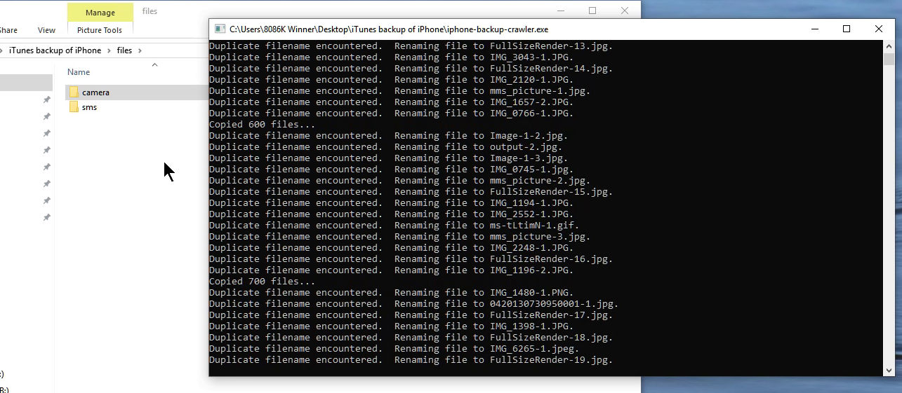

# itunes-backup-renamer-go

**Currently a work in progress.**

itunes-backup-renamer is a quick and dirty Go program that renames the human-unfriendly filenames created by iTunes and renames them back into their original filenames.

## Quick!  How do I use this?!

1. Create an **unencrypted** iTunes backup of your iOS device.
1. [Locate](https://support.apple.com/en-us/HT204215) the backup that iTunes created.  (The link provided goes to an Apple Support article on how to locate iTunes backups.  If this link is broken, then Apple has updated their support page and this script may no longer work on your iTunes backup.  But you can always consult a search engine for this info if you still want to try!)
1. [Download](https://github.com/chuynh18/tunes-backup-renamer-go/raw/master/iphone-backup-crawler-win.7z) the iphone-backup-crawler executable and place it inside your iTunes backup folder.
1. Run the executable and wait for it to finish.
1. Your files are now sitting inside the `files` directory.

## See it in action

## Motivation
There are a ton of trialware and shareware apps (that look a whole lot friendlier and more polished, to be fair!) that will help you recover files from your iOS device.  However, they are often limited in their capabilities until you pony up the $20 or $30 to fully unlock all their features.  I did not want to pay $20 or $30.

I [originally](https://github.com/chuynh18/itunes-backup-renamer/) did this as a Node.js (JavaScript) script.  Nothing wrong with that as it works, but it's more effort for the end-user versus a statically-linked and compiled executable.

## What does it do?

This program crawls the iTunes-created backup for jpg and mov files captured by the device's camera, along with most images and videos sent to or from the device via SMS/MMS.  It then copies them to the `files` directory under a more human-friendly name.

## How does it work?

Apple obfuscates files saved from iOS devices via the iTunes backup function.  The filenames on your local machine are SHA-1 hashes of the concatenation of the iOS domain, the dash character `-`, and the path to the file on the iOS device.  A SQLite database is also saved under the name `Manifest.db` in the backup folder.  This database stores both the obfuscated name and the original filename.

This program uses `Manifest.db` to rename the obfuscated names back to the original names.  If duplicate filenames are encountered, a dash and number are appended to the filename but before the file extension.

## Requirements

* [This executable](https://github.com/chuynh18/tunes-backup-renamer-go/raw/master/iphone-backup-crawler-win.7z).
* [iTunes](https://www.apple.com/itunes/download/) - to create the iTunes backup
* [An](https://www.apple.com/iphone/) [iOS](https://www.apple.com/ipad/) [device](https://www.apple.com/ipod-touch/).  Otherwise, you wouldn't have this problem to begin with, right!?

## Caveats

tl;dr:  Does not work on older versions of iOS.  Does not target audio files at all.  I haven't tested this program on anything other than Windows, but hope it will just work on other platforms.  You may need a LOT of hard drive space to run this to completion!

Apple changes how they save files on iOS devices every so often, so this program probably only works on recent versions of iOS.  I am not totally sure which versions, as I only wrote this to save files off a relative's iPhone and am not an iOS user myself!  He also didn't store any music on his iPhone, which is why this program doesn't currently target audio files.

As for why you need lots of hard drive space, this program copies rather than renames/moves files.  So if you have a 128 GB iPhone that is nearly full, you may need up to 256 GB of free hard drive space to run this program to completion.  If you're running this on an SSD, prepare to have it slammed with writes, but at least it'll complete quickly!  If you're running this on a hard drive, have fun waiting.  If you're running this on a RAM or 3D XPoint drive, wtf?

Linux and macOS binaries are available, but I don't know if they work at all.

And now for some fun copypasta, because I guarantee absolutely nothing:

**THE SOFTWARE IS PROVIDED "AS IS", WITHOUT WARRANTY OF ANY KIND, EXPRESS OR IMPLIED, INCLUDING BUT NOT LIMITED TO THE WARRANTIES OF MERCHANTABILITY, FITNESS FOR A PARTICULAR PURPOSE, TITLE AND NON-INFRINGEMENT. IN NO EVENT SHALL THE COPYRIGHT HOLDERS OR ANYONE DISTRIBUTING THE SOFTWARE BE LIABLE FOR ANY DAMAGES OR OTHER LIABILITY, WHETHER IN CONTRACT, TORT OR OTHERWISE, ARISING FROM, OUT OF OR IN CONNECTION WITH THE SOFTWARE OR THE USE OR OTHER DEALINGS IN THE SOFTWARE.**

Licensed under... [ISC](https://www.isc.org/licenses/).

Lastly, please remember:  "This worked on my machine!" - Me, July 9th, 2019